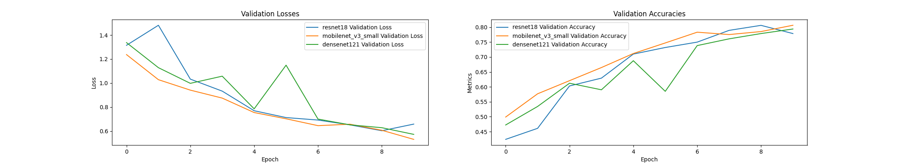
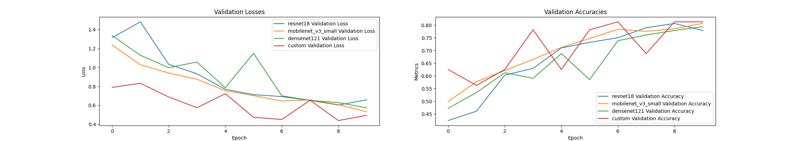

# Computer Vision Project

```sh
git clone https://github.com/sehnryr/computer-vision-project.git

pip install -r requirements.txt

python sort_pokedex.py
python sort_by_id.py
python sort_by_generation.py
python split_train_val.py

python main.py # or plot.py to only plot the results and not train the models
```

## Module 1 (21 points)

> [!NOTE]
> Prepare an image dataset for model training purposes, divide into a training
> and validation dataset, and pick an adequate model for training.

For this project, I will use multiple datasets from Kaggle[^1] to create a
dataset of Pokemon images.

The datasets are first normalized using the shortened `csv` file got through the
script [`sort_pokedex.py`](./sort_pokedex.py).

The images are then sorted by ID and then by generation using the scripts 
[`sort_by_id.py`](./sort_by_id.py) and [`sort_by_generation.py`](./sort_by_generation.py).

Finally, the images are splited into training(80%) and validation(20%) datasets
using the script [`split_train_val.py`](./split_train_val.py).

The chosen model is a Convolutional Neural Network (CNN) with a ResNet architecture.

[^1]: https://www.kaggle.com/datasets/divyanshusingh369/complete-pokemon-library-32k-images-and-csv,
https://www.kaggle.com/datasets/giovaniandrade/pokemon-images,
https://www.kaggle.com/datasets/anikabxy88/pcgv12augmented-pokmon-image-data,
https://www.kaggle.com/datasets/truthisneverlinear/pokemon-generations-image-dataset,
https://www.kaggle.com/datasets/mariotormo/complete-pokemon-dataset-updated-090420

## Module 2 (21 points)

> [!NOTE]
> Define classes of objects that the model detects on images and measure the
> precision of object detection. Compare different architectures of models to
> improve the results.

The classes chosen are the first 5 generations of Pokemon. The model is trained
to detect these classes on images. MobileNetV3Small and DenseNet121 are also
tested to compare the results.



To improve the results, we can use those 3 models in conjunction with a voting
system to classify the images.

## Module 3 (21 points)

> [!NOTE]
> Implement an algorithm in Python for chosen computer vision dataset and
> demonstrate the functionality. Compare your model with state of the art
> models using evaluation metrics.

```py
custom_model = keras.Sequential([
    keras.layers.Conv2D(32, (3, 3), input_shape=(input_size[0], input_size[1], 3), activation='relu'),
    keras.layers.MaxPooling2D(pool_size=(2, 2)),
    keras.layers.Conv2D(64, (3, 3), activation='relu'),
    keras.layers.MaxPooling2D(pool_size=(2, 2)),
    keras.layers.Flatten(),
    keras.layers.Dense(64, activation='relu'),
    keras.layers.Dense(num_classes, activation='softmax')
])
custom_model.compile(optimizer='adam', loss='categorical_crossentropy', metrics=['accuracy'])
```

The custom model is a simple CNN with 2 convolutional layers and 2 max pooling
layers. The model is trained using the same training dataset and evaluated using
the same validation dataset as the previous models.

To train the model, a wrapper class is created to handle the training and
evaluation loaders:

```py
class DataLoaderWrapper(keras.utils.Sequence):
    def __init__(self, dataloader):
        self.dataloader = dataloader
        self.dataset = dataloader.dataset
        self.batch_size = dataloader.batch_size

    def __len__(self):
        return len(self.dataloader)

    def __getitem__(self, idx):
        batch = next(iter(self.dataloader))
        inputs, labels = batch
        inputs = inputs.permute(0, 2, 3, 1).numpy()  # Change shape to (batch_size, height, width, channels)
        labels = keras.utils.to_categorical(labels.numpy(), num_classes=len(self.dataset.classes))  # Convert to one-hot encoding
        return inputs, labels
...

history = custom_model.fit(
    DataLoaderWrapper(train_loader),
    epochs=num_epochs,
    validation_data=DataLoaderWrapper(val_loader)
)
```



## Module 4 (21 points)

> [!NOTE]
> Enrich the dataset by adding custom images. Add and annotate images based
> on yout computer vision problem. For example, this could be semantic
> annotation and rectangle annotation for annotating object on images to enhance
> the dataset and measure the accuracy.

